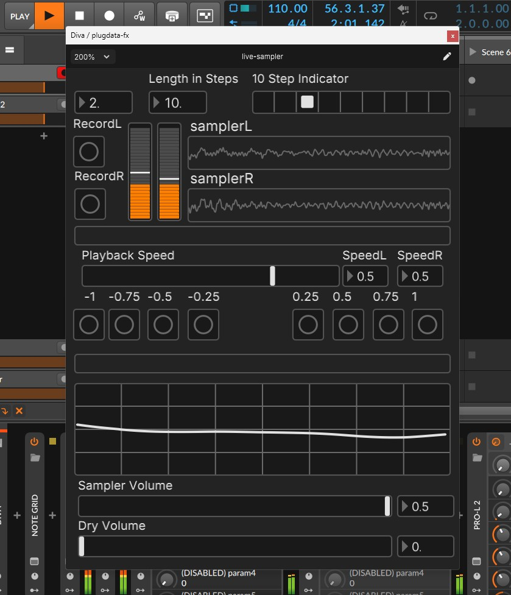

# pd-patches

A repository of my own Pure Data patches. These shouldn't be considered the peak of what can be accomplished with the wonderful Pd, but the ramblings of a madman who's figuring things out as he goes.

## live-sampler

This is based on [Polarity's Short Sampler Effect](https://www.youtube.com/watch?v=v9a9qXfHdtc) and tries to expand upon it while also creating a graphical interface for ease of use. Do note that a prerequisite is to use the Plug Data distribution as it uses the `playhead` object to sync to a DAW. You should also set your sample rate to 48000Hz or modify the objects requiring the sample rate to accomodate for your own.